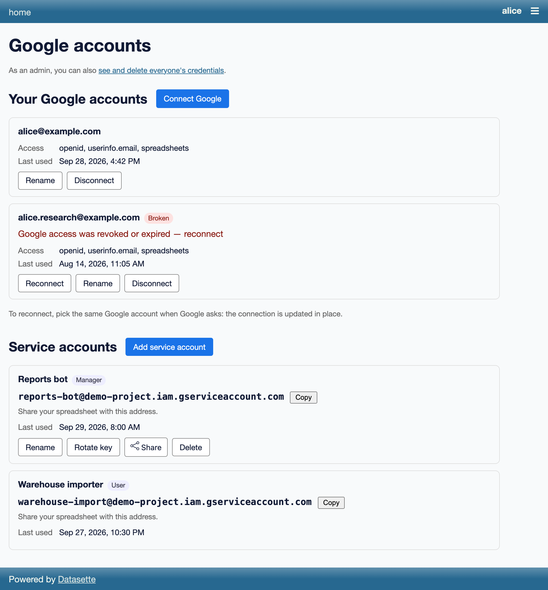
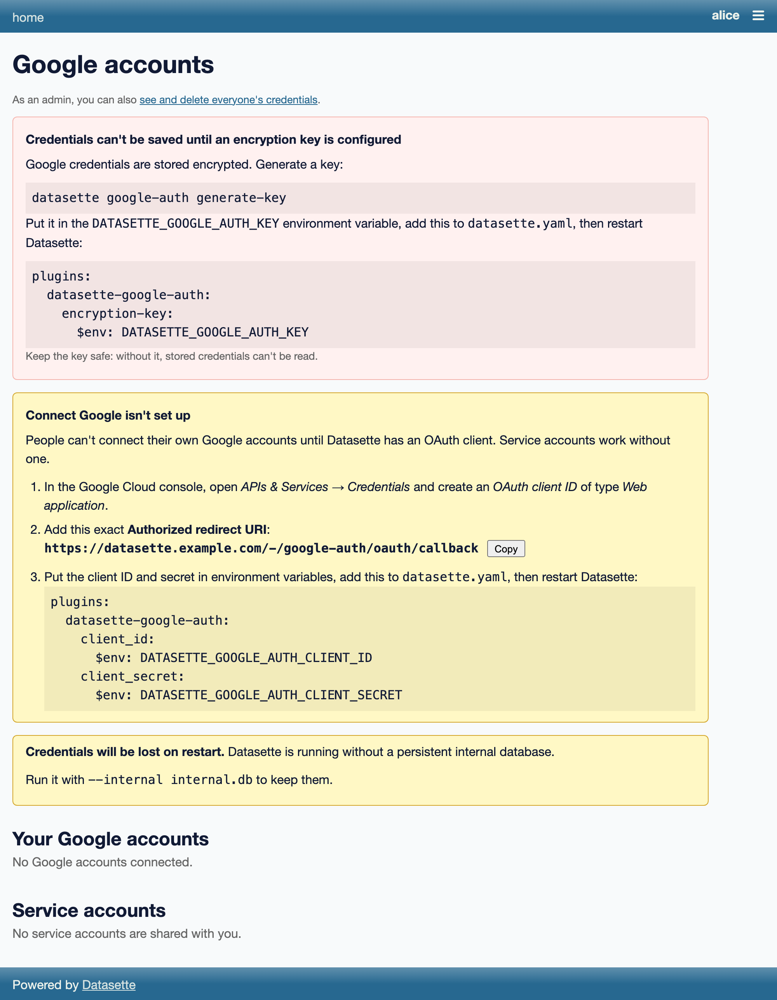
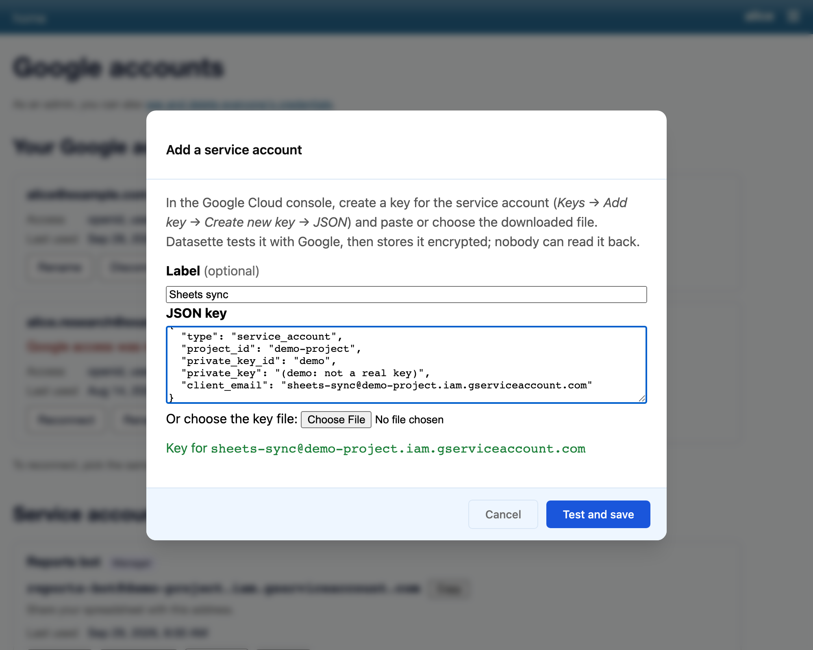
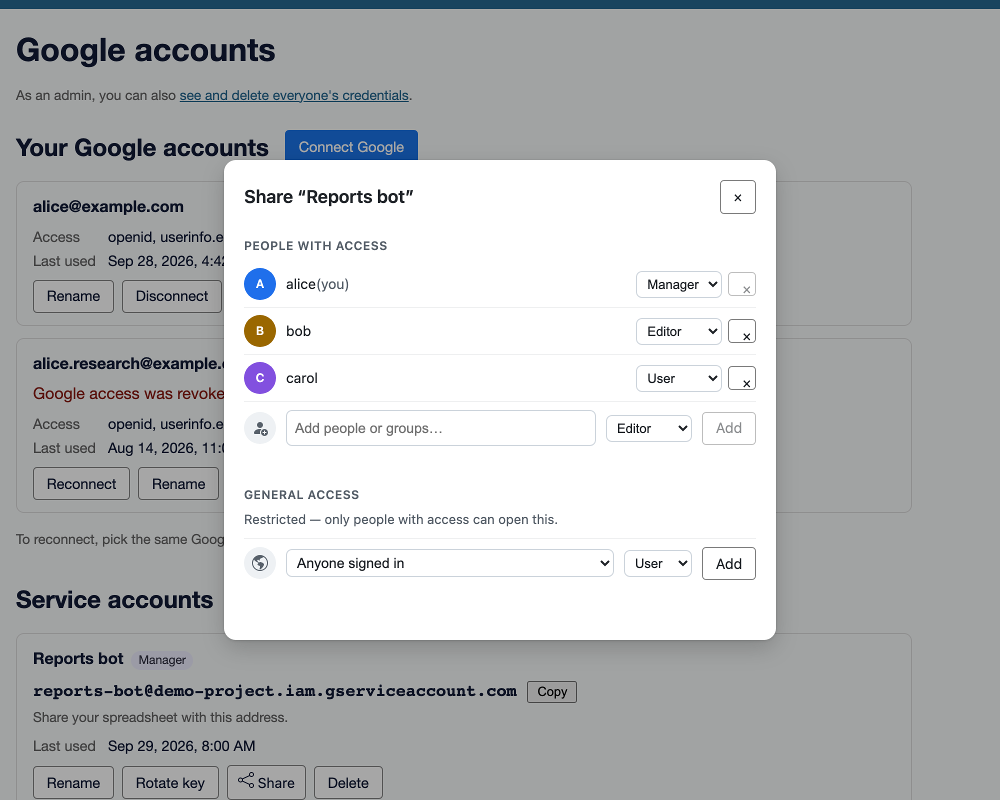
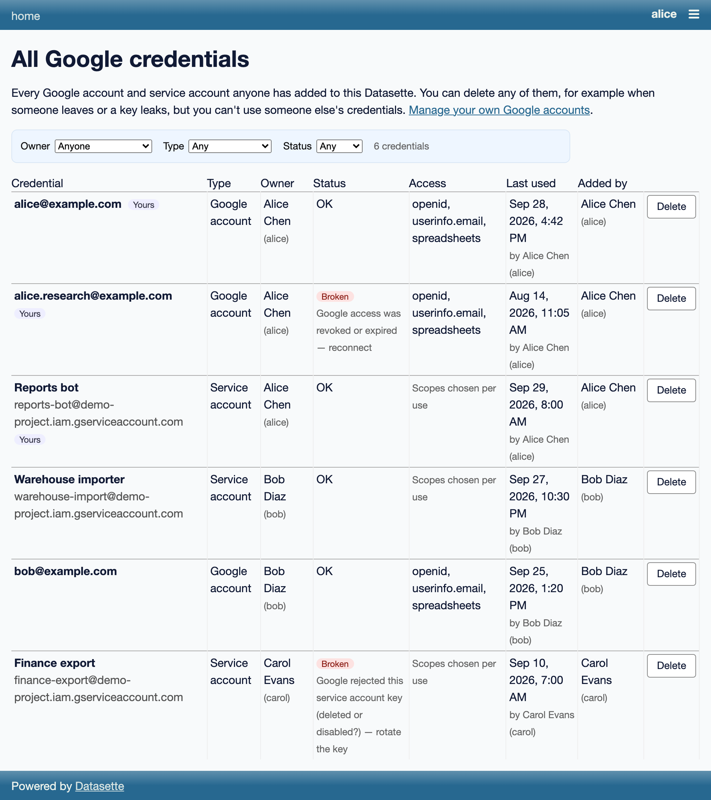

# datasette-google-auth

Google credentials for Datasette: shared service accounts and per-user OAuth
connections, stored encrypted and brokered to other plugins.

This is a **base plugin**. On its own it lets people connect Google accounts
and add service-account keys at `/-/google-auth`; other plugins then ask it
for an access token (or an authenticated request) on behalf of the signed-in
actor. It adds nothing to SQL: no functions, no virtual tables.

Two sample consumers in [`samples/`](samples/) show what a plugin built on it
looks like:

- [`samples/google_sheets_import.py`](samples/google_sheets_import.py): import
  a Google Sheet into a new or existing table
- [`samples/google_sheets_export.py`](samples/google_sheets_export.py): export
  a table or a query's results to a new or existing Google Sheet

Load them with `--plugins-dir samples` (`just dev` does).

## How it works

**Two kinds of credential.**

- A **service account** is a Google Cloud robot identity. Someone with
  `google-auth-add-service-account` pastes its JSON key, and can then share it
  with other people through the
  [datasette-acl-share](https://github.com/datasette/datasette-acl-share)
  dialog. It can only open spreadsheets that were shared with its
  `client_email`.
- A **Google OAuth connection** ("Connect Google") is one person's own Google
  account. It is **owner-only and can never be shared**, not even by an
  administrator. A person can connect several Google accounts; reconnecting
  the same one updates it in place.

**Secrets are encrypted at rest.** Service-account private keys and OAuth
refresh tokens are stored in Datasette's internal database, encrypted with
[Fernet](https://cryptography.io/en/latest/fernet/) under a key you configure.
Access tokens are never stored: they live in an in-memory cache in each
process and are refreshed shortly before they expire.

**Every use is checked against the database.** `get_credential()`, and every
`token()` or `request()` on the credential it returns, re-reads the
credential's row and re-checks the actor's access before touching the token
cache. Deleting a credential, unsharing a service account or Google rejecting
a key takes effect on the next call, in every process.

## Installation

Not yet released on PyPI. It needs Datasette 1.0a41 or later, and
[datasette-acl](https://github.com/datasette/datasette-acl) and
datasette-acl-share, which are installed as dependencies. See
[Development](#development) to run it from a checkout.

## Configuration

### 1. Generate an encryption key

```bash
datasette google-auth generate-key
```

This prints a new Fernet key. Keep it secret and keep it safe: anyone who has
it **and** a copy of the internal database can read every stored Google
credential, and if you lose it, every stored credential becomes unreadable.
Pass it to Datasette through an environment variable, never on the command
line or in a committed file.

Without an `encryption-key` the plugin still starts, but nobody can add a
credential and the management page shows a setup notice (see
[The management page](#the-management-page)). A malformed key
stops Datasette from starting.

### 2. Run with a persistent internal database

> [!WARNING]
> **Always start Datasette with `--internal path/to/internal.db`.** Every
> credential, and every sharing grant, lives in the internal database. Without
> `--internal`, Datasette uses a temporary file that is deleted when it exits,
> so every connected account and service account vanishes on restart.
> `GET /-/google-auth/api/status` reports this as `internal_db_persistent`,
> and the management page shows a warning.

### 3. `datasette.yaml`

```yaml
plugins:
  datasette-google-auth:
    # Required to store credentials. A list enables key rotation (see below).
    encryption-key:
      $env: DATASETTE_GOOGLE_AUTH_KEY
    # Optional: both are needed for "Connect Google". Without them, only
    # service accounts are available.
    client_id:
      $env: DATASETTE_GOOGLE_AUTH_CLIENT_ID
    client_secret:
      $env: DATASETTE_GOOGLE_AUTH_CLIENT_SECRET
    # Optional: the scopes "Connect Google" asks for. This is the default;
    # openid and email are always added if you leave them out.
    scopes:
      - openid
      - email
      - https://www.googleapis.com/auth/spreadsheets
    # Optional: only needed behind a proxy that hides the public URL.
    # redirect_uri: https://datasette.example.com/-/google-auth/oauth/callback

permissions:
  # Everyone signed in can connect their own Google account...
  google-auth-connect:
    id: "*"
  # ...only these people can add service accounts...
  google-auth-add-service-account:
    id: [alice, bob]
  # ...and only alice can list and delete everyone's credentials.
  google-auth-admin:
    id: alice
```

```bash
export DATASETTE_GOOGLE_AUTH_KEY="<output of datasette google-auth generate-key>"
export DATASETTE_GOOGLE_AUTH_CLIENT_ID="<your-client-id>.apps.googleusercontent.com"
export DATASETTE_GOOGLE_AUTH_CLIENT_SECRET="<your-client-secret>"
datasette serve data.db -c datasette.yaml --internal internal.db
```

`id: "*"` matches any actor that has an `id`, meaning anyone signed in; that is
Datasette's documented syntax for granting a plugin action to all signed-in
users (["Other permissions in datasette.yaml"](https://docs.datasette.io/en/latest/authentication.html#other-permissions-in-datasette-yaml)).
All three actions default to deny. The plugin config is validated at startup:
an unknown key or a bad value stops Datasette with an error that names the
field (and never echoes its value).

### Rotating the encryption key

`encryption-key` accepts a list. The **first** key encrypts, and **every** key
is tried when decrypting. To replace a key:

1. Generate a new one with `datasette google-auth generate-key` and put it in
   a new environment variable.
2. **Prepend** it to the list, keeping the old key after it, and restart
   Datasette:

   ```yaml
   plugins:
     datasette-google-auth:
       encryption-key:
         - $env: DATASETTE_GOOGLE_AUTH_KEY_NEW
         - $env: DATASETTE_GOOGLE_AUTH_KEY
   ```

   New and updated credentials are now encrypted with the new key, and
   credentials are re-encrypted as they are read.
3. Re-encrypt everything else now, with the same configuration file and
   environment variables the server uses:

   ```bash
   datasette google-auth rotate-keys --internal internal.db -c datasette.yaml
   ```

   It prints how many credentials it re-encrypted. If any could not be
   decrypted with any configured key it lists their ids and exits non-zero:
   **don't drop the old key until it succeeds.** Pass the keys through
   `-c` and `$env`, as above, rather than `-s plugins.datasette-google-auth.encryption-key ...`,
   which would put the key in your shell history.
4. **Drop** the old key from the list and restart.

Each rewrite is a compare-and-swap, so running `rotate-keys` while the server
is up is fine, as long as the server was already restarted in step 2. If a
key is removed too early, the affected credentials fail with
`credential_undecryptable` ("cannot decrypt — was encryption-key changed?")
and are left untouched: putting the old key back fixes them.

## The management page

`/-/google-auth` is where people connect Google accounts, add, rename,
rotate, share and delete service accounts, and delete credentials. The
Datasette menu links to it as "Google accounts" for signed-in actors who hold
any of the three global actions (see [Permissions](#permissions)).



- **Anonymous visitors get 403.** Any signed-in actor gets the page, even
  without a google-auth action: a service account may have been shared with
  them, and the page is where they find its `client_email` to share sheets
  with.
- **Connect Google and Reconnect come back to the page**, and report the
  result as Datasette flash messages: connected, cancelled, or connected
  without every requested scope (with a prompt to reconnect).
- **Setup notices** appear when something is missing: the `encryption-key`,
  the OAuth client, or a persistent internal database. The fix (config
  snippets, and the exact redirect URI to register) is shown only to
  `google-auth-admin` actors, which includes root under `--root`; everyone
  else sees a short notice to ask an admin.



## Google Cloud setup for "Connect Google"

Skip this section if you only want service accounts.

1. **Create or pick a project** in the [Google Cloud console](https://console.cloud.google.com/).
2. **Enable the Google Sheets API** (and any other API your consumer plugins
   call): APIs & Services > Library, or directly
   [Enable Sheets API](https://console.cloud.google.com/apis/enableflow;apiid=sheets.googleapis.com)
   ([Google: enable Workspace APIs](https://developers.google.com/workspace/guides/enable-apis)).
3. **Configure the consent screen**: Google Auth platform > Branding, then
   Audience ([Google: configure the OAuth consent screen](https://developers.google.com/workspace/guides/configure-oauth-consent)).
   - **User type.** *Internal* is only available to a project that belongs to
     a Google Workspace or Cloud Identity organization, and limits sign-in to
     that organization's members. *External* allows any Google account
     ([Google: manage app audience](https://support.google.com/cloud/answer/15549945)).
   - **Publishing status** (External only). *Testing* limits the app to at
     most 100 test users that you list on the Audience page; *In production*
     is open to any Google account (same page). See the caveats below before
     you choose.
   - Under **Data access**, add the scopes you configure in `scopes`.
4. **Create a client**: Google Auth platform > Clients > Create client >
   *Web application*
   ([Google: create credentials](https://developers.google.com/workspace/guides/create-credentials)).
   Under **Authorized redirect URIs** add your instance's callback URL,
   exactly:

   ```
   https://<your-datasette-host>/-/google-auth/oauth/callback
   ```

   Datasette builds it from the incoming request, so it must match the scheme
   and host your users see. Until the client is configured, the management
   page shows admins the exact URI your instance will send. Behind a proxy
   that rewrites the host or scheme, set `redirect_uri` in the plugin config
   to the public URL and register that.
5. Put the client ID and secret in the environment variables your
   `datasette.yaml` reads (`DATASETTE_GOOGLE_AUTH_CLIENT_ID` and
   `DATASETTE_GOOGLE_AUTH_CLIENT_SECRET` above) and restart.

Connecting always asks for `access_type=offline` and `prompt=consent`, with
PKCE and a signed, actor-bound `state`, so that Google returns a refresh
token. If it doesn't, the callback says so and suggests removing the app from
the Google account's third-party access page (see below) and connecting again.

### Google's verification caveats

Each of these is Google's policy, not this plugin's, and each is taken from
the linked Google page as of 2026-09-29. Google changes these rules: check the
links before you rely on them.

- **The default scope is sensitive.** Google classifies
  `https://www.googleapis.com/auth/spreadsheets` (and
  `spreadsheets.readonly`) as **sensitive** scopes
  ([Google: Sheets API scopes](https://developers.google.com/workspace/sheets/api/scopes)).
- **Unverified apps show a warning and have a user cap.** An app that
  requests sensitive or restricted scopes and hasn't completed Google's
  verification may show an "unverified app" screen before the consent screen,
  and is limited to 100 new users in total after that screen is shown
  ([Google: unverified apps](https://support.google.com/cloud/answer/7454865)).
  Google says apps in development or testing aren't subject to verification
  but do get the unverified-app screen and the 100-user cap
  ([Google: when verification is not needed](https://support.google.com/cloud/answer/13464323)).
- **Refresh tokens expire after 7 days in *Testing*.** For an External app
  with publishing status *Testing*, Google issues refresh tokens that expire
  in 7 days, unless the only scopes requested are a subset of name, email
  address and user profile
  ([Google: Using OAuth 2.0 to access Google APIs, "Refresh token expiration"](https://developers.google.com/identity/protocols/oauth2#expiration);
  also [manage app audience](https://support.google.com/cloud/answer/15549945)).
  Since `spreadsheets` is always requested here, every connection made while
  the app is in Testing stops working after a week: the credential is marked
  **broken** and its owner sees "Reconnect".
- **Internal apps skip verification.** An app used only by people in your
  Google Workspace or Cloud Identity organization, and designated
  internal-only, doesn't get the unverified-app screen or the 100-user cap
  ([Google: when verification is not needed](https://support.google.com/cloud/answer/13464323)).
  If all your users are in one Workspace organization, choose *Internal*.
- **`drive.file` is non-sensitive**
  ([Google: Sheets API scopes](https://developers.google.com/workspace/sheets/api/scopes)),
  while `drive` is restricted. v0 doesn't use it: a `drive.file` mode with
  the Google Picker, which would avoid the sensitive-scope review, is a
  possible future addition, not a v0 feature.

**Removing access from the Google side.** A person can revoke this app's
access to their Google account at any time. Google's current help page says
to do it from the "linked apps" page,
[myaccount.google.com/linkedapps](https://myaccount.google.com/linkedapps)
([Google: manage links between your Google Account and third-party apps](https://support.google.com/accounts/answer/13533235)).
The plugin's own messages point there too. The next token refresh then
fails, and the credential is marked broken.

**Unverified:** whether Google's token response reports the `email` scope as
`email` or as `https://www.googleapis.com/auth/userinfo.email`. Google's
documentation doesn't say. It makes no difference here: the broker treats the
two spellings as the same scope (see [Scopes](#scopes)).

## Service accounts

1. **Create a service account** in the Cloud console: IAM & Admin > Service
   Accounts > Create service account
   ([console](https://console.cloud.google.com/iam-admin/serviceaccounts);
   [Google: create credentials](https://developers.google.com/workspace/guides/create-credentials)).
   Enable the Sheets API in the same project, as in step 2 above.
2. **Create a JSON key**: open the service account, then Keys > Add key >
   Create new key > JSON > Create. The key file downloads once and can't be
   downloaded again
   ([Google: create and delete service account keys](https://docs.cloud.google.com/iam/docs/keys-create-delete)).
3. **Add it** at `/-/google-auth` (needs `google-auth-add-service-account`):
   paste the file's contents. The plugin checks that it is a service-account
   key with a parseable RSA private key and a `client_email` ending in
   `.gserviceaccount.com`, then **exchanges it for a token with Google before
   saving**, so a deleted or disabled key is rejected immediately. Only
   `client_email`, `private_key`, `private_key_id` and `project_id` are kept
   (encrypted); the rest of the file, including its `token_uri`, is discarded.
   The key is never shown again.
4. **Share spreadsheets with its `client_email`** (shown prominently after you
   add it) using the sheet's Share button: **Viewer** is enough for an import,
   an export needs **Editor**. A service account can't open anything that
   isn't shared with it, and in v0 it can't create new spreadsheets (a file it
   created would live in its own Drive, invisible to you): the export sample
   writes only into existing sheets shared with it as Editor.
5. **Share the credential with people** through the share dialog, as User,
   Editor or Manager (see [Permissions](#permissions)). You are its Manager.





**Rotating a service-account key.** Create a new key in the Cloud console,
then use "Rotate key" on the credential (needs Editor) and paste it. The new
key is tested with Google before it replaces the old one. Then delete the old
key in the console.

**Deleting a service account credential** removes it from Datasette only:
**the key still exists at Google** and still works for anyone who has a copy.
After deleting, the plugin tells you the key's `private_key_id` and links to
the project's Service accounts page, where you should delete it: open the
service account, go to the Keys tab and delete that key
([Google: create and delete service account keys](https://docs.cloud.google.com/iam/docs/keys-create-delete)).
The link is `https://console.cloud.google.com/iam-admin/serviceaccounts?project=<project_id>`:
the page's address is from Google's documentation, but the `?project=`
parameter is **unverified**.

If Google rejects a stored key (`invalid_grant`, usually because the key was
deleted or disabled), the credential is marked **broken** with "rotate the
key".

## Permissions

datasette-acl is a hard dependency. Three **global** actions are granted in
`datasette.yaml` `permissions:` blocks (or by any permission plugin):

| Action | Allows |
| ------ | ------ |
| `google-auth-connect` | Connect your own Google account ("Connect Google") |
| `google-auth-add-service-account` | Add a service account |
| `google-auth-admin` | List every credential, and delete any of them. **Never** use, rename or rotate someone else's |

Three **per-service-account** actions are datasette-acl grants on the resource
type `google-service-account` (one level: the credential id), bundled into
three roles:

| Action | Allows | Role |
| ------ | ------ | ---- |
| `google-service-account-use` | Use it to call Google APIs through a consumer plugin. Never read its key | User, Editor, Manager |
| `google-service-account-edit` | Rename it, rotate its key. Also requires `-use` | Editor, Manager |
| `google-service-account-manage` | Share it, delete it. Also requires `-use` | Manager |

Whoever adds a service account is seeded as its Manager.

**OAuth connections are owner-only, and that is structural.** They aren't a
datasette-acl resource at all: the broker compares the credential's owner
with `actor["id"]` in code and never calls `datasette.allowed()` for one.
It has to be this way because datasette-acl has no hook to veto a grant:
any Manager or root actor could write a grant row for any id through acl's
API, so a UI rule ("OAuth credentials have no share button") would not be
enough. Instead, the `google-service-account` resource only ever lists
service accounts, so acl refuses grants on an OAuth credential's id, and even
a grant row written directly into the database is ignored.

Who can do what with a credential:

| | OAuth connection | Service account |
| - | ---------------- | --------------- |
| Use (get a token) | Owner only | `-use` (User and up) |
| Rename | Owner only | `-edit` (Editor and up) |
| Rotate key | n/a (reconnect instead) | `-edit` (Editor and up) |
| Share | Never | `-manage` (Manager) |
| Delete | Owner, or `google-auth-admin` | `-manage`, or `google-auth-admin` |

An id you can't see behaves exactly like one that doesn't exist (404
`not_found`), so ids can't be probed. You get 403 `forbidden` only for a
credential you can see but not act on: as `google-auth-admin` looking at
someone else's, or as a service account's User trying to rename it.

`--root` holds every action unless a `permissions:` block for it names
someone else, so by default root can use, share and delete every service
account and delete any credential. Root still can't use anyone's OAuth
connection.

## Security model

What the plugin protects:

- **Secrets are encrypted at rest** (Fernet, `encryption-key`). Only
  service-account keys and OAuth refresh tokens are stored; labels, Google
  email addresses and granted scopes are plaintext.
- **Access tokens are in memory only**, per process, never written to disk.
  Consumer plugins get them; browsers never do.
- **No secret leaves the plugin.** Keys and refresh tokens never appear in an
  API response, the UI, a log line, an event, an exception message or
  telemetry. A pasted key is write-only.
- **Tokens only go to Google.** `Credential.request()` sends the bearer
  token only to `https://` URLs on `*.googleapis.com` (or on a configured
  `google_base_urls` origin) with no username or password in them;
  anything else raises `DisallowedHost` before a token is fetched. A
  consumer can opt out per call with `allow_any_host=True`.
- **A key file's `token_uri` is ignored.** Service-account tokens are always
  minted at `https://oauth2.googleapis.com/token`. Honouring `token_uri` would
  send a signed assertion to whatever URL a pasted file names.
- **Revocation is immediate.** Every token request re-reads the credential
  and re-checks access (see [How it works](#how-it-works)). One caveat:
  Datasette caches permission checks for the length of one HTTP request, so
  unsharing a service account applies from the next request.
- **Deleting an OAuth connection revokes it at Google** (best effort). The row
  is deleted either way, and the result says whether Google confirmed the
  revocation.
- **The OAuth flow is bound to the actor who started it**: signed, 10-minute
  `state`; a matching nonce in a signed, HttpOnly flow cookie scoped to
  `/-/google-auth/`; PKCE. `return_to` must be a same-origin path, or the
  flow falls back to `/-/google-auth`.
- **CSRF:** the JSON API needs no token. Datasette (1.0a41 and later) rejects
  cross-site browser POSTs using `Sec-Fetch-Site` / `Origin` before any route
  runs; same-origin `fetch()` and non-browser clients pass. Send
  `Content-Type: application/json`.
- **Request bodies are capped at 16 KB** on every plugin route (a JSON 413
  `payload_too_large`). A service-account key file is about 2.4 KB.

What `google-auth-admin` can and can't do: it can list every credential with
its owner and last use (the "All Google credentials" page at
`/-/google-auth/admin`, linked from the management page, or
`GET /-/google-auth/api/admin/credentials`), and delete any credential, which
revokes an OAuth grant at Google. It **cannot**
use, rename or rotate someone else's credential, share a service account, or
see any secret. It is meant for offboarding and incidents.



What isn't protected:

- **A root actor can delete everything** and use every service account (see
  above).
- **Whoever holds the `encryption-key` and a copy of the internal database
  can decrypt every stored credential.** Protect backups of `internal.db` and
  the key separately.
- **Installed plugins are trusted.** The Python API takes the `actor` its
  caller passes in; any plugin can pass any actor. Only install consumer
  plugins you trust.
- **Deleting a service account doesn't delete its key at Google.** Delete it
  in the Cloud console, as above.
- **A departing user's OAuth connections stay** until they or a
  `google-auth-admin` delete them.

## Using it from a plugin

Everything below is importable from `datasette_google_auth`. Always pass the
actor the request is for; there is no "system" mode in v0, so a credential
can only be used during a request by an actor who may use it.

### Listing and getting credentials

```python
from datasette_google_auth import get_credential, list_credentials

SHEETS_READONLY = "https://www.googleapis.com/auth/spreadsheets.readonly"

# What may this actor use for a read-only Sheets call?
credentials = await list_credentials(
    datasette, actor=request.actor, scopes=[SHEETS_READONLY]
)

# Check one of them (normally the id the user picked) and use it.
cred = await get_credential(
    datasette, credentials[0].id, actor=request.actor, scopes=[SHEETS_READONLY]
)
response = await cred.request(
    "GET", "https://sheets.googleapis.com/v4/spreadsheets/SPREADSHEET_ID"
)
```

**`await list_credentials(datasette, *, actor, scopes=None)`** returns a
`list[CredentialInfo]`: the actor's own OAuth connections, then the service
accounts shared with them. With `scopes`, OAuth connections that weren't
granted them are left out; service accounts always qualify, because they mint
whatever scopes are asked for (whether a given file is shared with one only a
request can tell). Broken credentials are included, so a picker can offer
"Reconnect". Anonymous actors get `[]`, and `google-auth-admin` doesn't widen
the list.

**`CredentialInfo`** is a Pydantic model with no secrets in it: `id` (a
ULID), `type` (`"google_oauth"` or `"service_account"`), `label`,
`google_email` (the Google account, or the service account's `client_email`:
tell users to share sheets with it), `scopes` (granted scopes, OAuth only),
`status` (`"ok"` or `"broken"`), `status_detail` and `is_owner`.

**`await get_credential(datasette, credential_id, *, actor, scopes)`** returns
a `Credential` after checking, against the database right now, that the actor
may use it for `scopes`. For a service account `scopes` must be non-empty
(`ValueError` otherwise).

**`Credential`** has `.id`, `.info` (its `CredentialInfo`) and:

- **`await cred.token()`**: a Google access token string for the requested
  scopes, from the cache or freshly minted or refreshed. Never log it or send
  it to a browser.
- **`await cred.request(method, url, *, allow_any_host=False, **kwargs)`**:
  an authenticated request with this plugin's `httpx2` client (no redirects
  followed). `url` must be `https://` on a `*.googleapis.com` host, without
  a username or password, or `DisallowedHost` is raised before any token is
  fetched or anything sent, so a bug can't hand the token to a third party.
  Pass `allow_any_host=True` only if you really mean to send a Google token
  somewhere else. `kwargs` go to
  `httpx2.AsyncClient.request` (`params`, `json`, `headers`...); any
  `Authorization` header is replaced. On a 401 the cached token is evicted and
  the request retried once, so the body must be replayable (not a stream).
  The response is returned whatever its status: a 403 or 404 from Google is
  yours to handle (for a service account it usually means "share the file
  with `cred.info.google_email`").

Both re-check access first, so a `Credential` held across calls stops working
as soon as it is deleted, unshared or marked broken.

### Scopes

Request the **narrowest** scope you need. A granted scope also covers the
narrower scopes in a small implication table:

| Granted | Also covers |
| ------- | ----------- |
| `…/auth/spreadsheets` | `…/auth/spreadsheets.readonly` |
| `…/auth/drive` | `…/auth/drive.readonly`, `…/auth/drive.file` |
| `email` | `…/auth/userinfo.email` (and the other way round) |

So the importer asks for `spreadsheets.readonly` and still matches a default
Connect Google grant of `spreadsheets`. Nothing else is implied, and never the
other way round (`spreadsheets.readonly` doesn't cover `spreadsheets`).

OAuth connections are checked against the scopes their owner granted. If one
is missing you get `MissingScopes`: with a `reconnect_url` if reconnecting can
fix it (every missing scope is in the configured `scopes`), or with
`not_configured` listing the scopes an administrator must add to `scopes`
first. Service accounts are minted exactly the scopes you ask for.

### Errors

Every error subclasses `GoogleAuthError` and has a stable `code`. Branch on
the class or the code, never the message. Messages contain no secrets and are
safe to show to the user.

| Exception | `code` | HTTP | Raised when |
| --------- | ------ | ---- | ----------- |
| `CredentialNotFound` | `not_found` | 404 | No such credential, or the actor can't see it; also any anonymous actor |
| `CredentialForbidden` | `forbidden` | 403 | The actor can see it but not do this (an admin using someone else's) |
| `MissingScopes` | `missing_scopes` | 403 | An OAuth connection lacks a requested scope. Has `.missing`, `.reconnect_url`, `.not_configured` |
| `CredentialBroken` | `credential_broken` | 409 | Google rejected the key or grant (`invalid_grant`). Has `.detail`, `.reconnect_url` (OAuth, owner) |
| `CredentialChanged` | `credential_changed` | 409 | It was reconnected or rotated while in use, twice in a row. Try again |
| `InvalidServiceAccountKey` | `invalid_service_account_key` | 400 | A pasted key was rejected (locally or by Google's test exchange) |
| `DisallowedHost` | `disallowed_host` | 400 | `Credential.request()` was given a URL that isn't `https://*.googleapis.com` (and `allow_any_host` wasn't set). Has `.host` |
| `GoogleTokenError` | `google_error` | 502 | A Google token endpoint failed another way (5xx, network, bad reply). Has `.status`, `.error`, `.description` |
| `EncryptionNotConfigured` | `encryption_not_configured` | 503 | No `encryption-key` |
| `CredentialUndecryptable` | `credential_undecryptable` | 500 | No configured key decrypts it (was `encryption-key` changed?) |
| `GoogleAuthError` | `google_auth_error` | 500 | Base class |

The HTTP API also returns `invalid_label` (400) for an empty or over-long
label, `payload_too_large` (413) and `internal_error` (500).

**`error_response(error)`** turns any of them into a Datasette JSON
`Response` with that status:

```json
{"ok": false, "error": "<message>", "code": "missing_scopes",
 "reconnect_url": "/-/google-auth/connect", "missing": ["..."]}
```

`reconnect_url` is present only when reconnecting can fix the problem, and
`missing` only for `MissingScopes`.

**Sending the user through Connect Google and back.** The `reconnect_url` on
an error has no `return_to` (the broker doesn't know your page). Build your
own with **`connect_url(datasette, return_to=path)`**, which returns
`/-/google-auth/connect?return_to=...` (with Datasette's `base_url` applied).
After connecting, the user lands back on `return_to`, which must be a
same-origin path.

### A complete consumer

A minimal plugin that previews the first rows of a spreadsheet as JSON,
trimmed from the importer sample. Save it in a plugins directory and open
`/-/sheet-preview` to list credentials, then
`/-/sheet-preview?credential=<id>&spreadsheet=<spreadsheet id>`. The test
suite runs this exact code (`tests/test_readme.py`).

<!-- readme-consumer-example -->
```python
from urllib.parse import quote

from datasette import Response, hookimpl

from datasette_google_auth import (
    CredentialBroken,
    GoogleAuthError,
    MissingScopes,
    connect_url,
    error_response,
    get_credential,
    list_credentials,
)

SHEETS_READONLY = "https://www.googleapis.com/auth/spreadsheets.readonly"
SHEETS_API = "https://sheets.googleapis.com/v4/spreadsheets"


async def sheet_preview(datasette, request):
    actor = request.actor
    here = request.full_path
    credential_id = request.args.get("credential")
    if not credential_id:
        credentials = await list_credentials(
            datasette, actor=actor, scopes=[SHEETS_READONLY]
        )
        return Response.json(
            {
                "credentials": [c.model_dump() for c in credentials],
                "connect_url": connect_url(datasette, return_to=here),
            }
        )

    spreadsheet = quote(request.args.get("spreadsheet", ""), safe="")
    try:
        cred = await get_credential(
            datasette, credential_id, actor=actor, scopes=[SHEETS_READONLY]
        )
        response = await cred.request(
            "GET", f"{SHEETS_API}/{spreadsheet}/values/A1:E5"
        )
    except (MissingScopes, CredentialBroken) as error:
        if not error.reconnect_url:
            return error_response(error)
        # Reconnecting can fix it: come back here afterwards.
        return Response.redirect(connect_url(datasette, return_to=here))
    except GoogleAuthError as error:
        return error_response(error)

    if response.status_code != 200:
        body = {"ok": False, "error": f"Google returned {response.status_code}"}
        if cred.info.type == "service_account":
            body["share_with"] = cred.info.google_email
        return Response.json(body, status=502)
    return Response.json({"ok": True, "values": response.json().get("values", [])})


@hookimpl
def register_routes():
    return [(r"^/-/sheet-preview$", sheet_preview)]
```

### HTTP endpoints for consumers

- **`GET /-/google-auth/api/credentials?scopes=a,b`** returns
  `{"credentials": [CredentialInfo, ...]}` for the current actor, the same as
  `list_credentials()`. `scopes` may be comma- or space-separated, or
  repeated. Anonymous actors get an empty list.
- **`GET /-/google-auth/connect?return_to=/path`** starts Connect Google and
  comes back to `return_to`. 404 if the OAuth client isn't configured, 403
  without `google-auth-connect`.

The rest of the JSON API serves the management page:

| Route | Does |
| ----- | ---- |
| `GET /-/google-auth/api/status` | Setup flags (encryption and OAuth configured, internal DB persistent, the redirect URI) and the actor's permissions |
| `GET /-/google-auth/api/admin/credentials?owner=&type=&status=` | Every credential with owner and last use, plus `actor_names` (display names from `actors_from_ids`) (`google-auth-admin`) |
| `POST /-/google-auth/api/service-accounts` `{label?, key_json}` | Add a service account; the response includes `share_with_email` |
| `POST /-/google-auth/api/credentials/{id}/rename` `{label}` | Rename |
| `POST /-/google-auth/api/credentials/{id}/rotate-key` `{key_json}` | Rotate a service account's key |
| `POST /-/google-auth/api/credentials/{id}/delete` | Delete; says whether Google confirmed an OAuth revocation, or which service-account key to delete in the console |

Errors from all of them use the `error_response()` shape above.

## Events

Registered with `register_events` and fired through `datasette.track_event()`,
so audit-log and alert plugins see them. Every event carries `actor`,
`credential_id`, `credential_type`, `owner_id` and `google_email`, and never a
secret. There are no per-use events: the credential's `last_used_at` /
`last_used_by` cover that.

| Event | Fired when | Extra fields |
| ----- | ---------- | ------------ |
| `google-auth-credential-created` | A service account is added, or a Google account connected for the first time | |
| `google-auth-credential-reconnected` | An existing Google connection is connected again | |
| `google-auth-credential-rotated` | A service account gets a new key | |
| `google-auth-credential-deleted` | A credential is deleted | `revoked`: for OAuth, whether Google confirmed the revocation; `None` for service accounts |
| `google-auth-credential-broken` | Google rejected the stored key or grant | `detail`: the message users see |

Rotating the `encryption-key` fires no event.

## Not in v0

- **Scheduling / background use.** Every token use happens inside a request,
  for the actor making it. Scheduled imports (for example with datasette-cron)
  would need an actor-less mode and are future work.
- **A credential picker component** for other plugins' UIs. Consumers build
  their own from `list_credentials()` or the credentials endpoint.
- **A proxy or browser-token endpoint.** Tokens stay on the server.
- **Other credential types**: API keys, application default credentials,
  domain-wide delegation.
- **A Sheets helper.** Consumers call the Sheets REST API with
  `cred.request()`.
- **`drive.file` + Google Picker** (incremental consent), and service
  accounts creating new spreadsheets.
- **An admin UI for the OAuth client.** `client_id` / `client_secret` are
  plugin config only.

## Development

```bash
uv sync
just test
just check
just dev
```

`uv sync` expects sibling checkouts of `datasette-acl` and `datasette-acl-share`
in `../` (see `[tool.uv.sources]` in `pyproject.toml`). `just dev` serves on
port 8021 with `--internal .tmp/internal.db`, grants every google-auth action
to everyone and loads `samples/`. The test suite never contacts Google: it
runs against an in-process mock (`tests/mock_google/`).

`just shots` regenerates the screenshots in `docs/screenshots/` with
Playwright, against throwaway servers seeded with demo data (no Google
calls). It needs Chromium once: `npx --prefix frontend playwright install chromium`.

## Telemetry

OpenTelemetry spans and metrics under the `datasette_google_auth` scope, using
Datasette's telemetry kit. Nothing is recorded unless you install an
OpenTelemetry SDK and provider. The reference below is generated from
`datasette_google_auth/telemetry_registry.py` by `just telemetry-doc`; don't
edit it by hand.

<!-- telemetry-reference:start -->

#### Spans

**`datasette_google_auth.token`** — `Credential.token()`: re-reading the credential, re-checking access, then serving from the token cache or minting/refreshing. On a cache miss the `token.mint` or `token.refresh` span is its child. Status is `ERROR` for any exception except the access decisions `CredentialNotFound`, `CredentialForbidden` and `MissingScopes`, which are outcomes (like an HTTP 4xx) and only set `error.type`.

Attributes:

- `datasette_google_auth.credential.id` — The credential's ULID. Opaque, and **spans only, never a metric dimension**. Owner, actor and email are never recorded.
- `datasette_google_auth.credential.type` *(optional)* — `service_account` or `google_oauth`. Set once the credential has been re-read; absent when it doesn't exist or the actor can't see it.
- `datasette_google_auth.cache` *(optional)* — `hit` or `miss`. Set once the token is in hand; absent when access was denied or the fetch failed.
- `error.type` *(optional)* — Class name of the exception that ended the operation. Never the message.

**`datasette_google_auth.request`** — `Credential.request()`: one authenticated call to a Google API, with its `token` span(s) as children (two on a 401 retry). A returned 4xx or 5xx is the consumer's to handle and leaves the status unset; status is `ERROR` only when an exception escapes, other than the access decisions the `token` span also exempts.

Attributes:

- `datasette_google_auth.credential.id` — The credential's ULID. Opaque, and **spans only, never a metric dimension**. Owner, actor and email are never recorded.
- `datasette_google_auth.credential.type` — `service_account` or `google_oauth`.
- `http.request.method` — The request method, clamped by core's `clamp_http_method` (anything outside RFC 9110 + PATCH is `_OTHER`).
- `server.address` — The host of the requested URL. Never the path or query.
- `http.response.status_code` *(optional)* — The HTTP status of the API's reply: the retry's, after a 401. Absent when no response arrived.
- `datasette_google_auth.retried` — `True` if the first response was a 401, so the cached token was evicted and the request retried once with a fresh one.
- `error.type` *(optional)* — Class name of the exception that ended the operation. Never the message.

**`datasette_google_auth.token.mint`** — A service-account JWT-bearer exchange at Google's token endpoint, for the broker or the live test when a key is added or rotated. Status is `ERROR` (with no description) whenever `outcome` isn't `ok`.

Attributes:

- `datasette_google_auth.scopes.count` — How many scopes the service-account token was minted for.
- `datasette_google_auth.outcome` — How the Google call ended: `ok`; `invalid_grant` (key deleted or disabled, grant revoked, code reused); `http_error` (any other non-200); `network_error` (Google never answered); `invalid_response` (a 200 without the expected fields).
- `http.response.status_code` *(optional)* — The HTTP status of Google's reply. Absent when Google never answered.
- `datasette_google_auth.google.error` *(optional)* — Google's OAuth `error` code, from a failed reply or the callback's `error` parameter. Clamped to the RFC 6749 / RFC 7009 codes plus Google's documented ones; anything else is `_OTHER`. Never the `error_description`.
- `error.type` *(optional)* — Class name of the exception that ended the operation. Never the message.

**`datasette_google_auth.token.refresh`** — An OAuth refresh-token grant at Google's token endpoint. Status is `ERROR` (with no description) whenever `outcome` isn't `ok`.

Attributes:

- `datasette_google_auth.outcome` — How the Google call ended: `ok`; `invalid_grant` (key deleted or disabled, grant revoked, code reused); `http_error` (any other non-200); `network_error` (Google never answered); `invalid_response` (a 200 without the expected fields).
- `http.response.status_code` *(optional)* — The HTTP status of Google's reply. Absent when Google never answered.
- `datasette_google_auth.google.error` *(optional)* — Google's OAuth `error` code, from a failed reply or the callback's `error` parameter. Clamped to the RFC 6749 / RFC 7009 codes plus Google's documented ones; anything else is `_OTHER`. Never the `error_description`.
- `datasette_google_auth.refresh_token.rotated` *(optional)* — `True` if Google returned a new refresh token. Set on success only.
- `error.type` *(optional)* — Class name of the exception that ended the operation. Never the message.

**`datasette_google_auth.oauth.exchange`** — The authorization-code (+ PKCE verifier) exchange during the Connect Google callback. Status is `ERROR` (with no description) whenever `outcome` isn't `ok`.

Attributes:

- `datasette_google_auth.outcome` — How the Google call ended: `ok`; `invalid_grant` (key deleted or disabled, grant revoked, code reused); `http_error` (any other non-200); `network_error` (Google never answered); `invalid_response` (a 200 without the expected fields).
- `http.response.status_code` *(optional)* — The HTTP status of Google's reply. Absent when Google never answered.
- `datasette_google_auth.google.error` *(optional)* — Google's OAuth `error` code, from a failed reply or the callback's `error` parameter. Clamped to the RFC 6749 / RFC 7009 codes plus Google's documented ones; anything else is `_OTHER`. Never the `error_description`.
- `error.type` *(optional)* — Class name of the exception that ended the operation. Never the message.

**`datasette_google_auth.oauth.userinfo`** — The OpenID userinfo call that identifies the Google account during the Connect Google callback. Status is `ERROR` (with no description) whenever `outcome` isn't `ok`.

Attributes:

- `datasette_google_auth.outcome` — How the Google call ended: `ok`; `invalid_grant` (key deleted or disabled, grant revoked, code reused); `http_error` (any other non-200); `network_error` (Google never answered); `invalid_response` (a 200 without the expected fields).
- `http.response.status_code` *(optional)* — The HTTP status of Google's reply. Absent when Google never answered.
- `datasette_google_auth.google.error` *(optional)* — Google's OAuth `error` code, from a failed reply or the callback's `error` parameter. Clamped to the RFC 6749 / RFC 7009 codes plus Google's documented ones; anything else is `_OTHER`. Never the `error_description`.
- `error.type` *(optional)* — Class name of the exception that ended the operation. Never the message.

**`datasette_google_auth.oauth.revoke`** — Best-effort revocation of a refresh token when an OAuth credential is deleted. The delete goes ahead either way. Status is `ERROR` (with no description) whenever `outcome` isn't `ok`.

Attributes:

- `datasette_google_auth.outcome` — How the Google call ended: `ok`; `invalid_grant` (key deleted or disabled, grant revoked, code reused); `http_error` (any other non-200); `network_error` (Google never answered); `invalid_response` (a 200 without the expected fields).
- `http.response.status_code` *(optional)* — The HTTP status of Google's reply. Absent when Google never answered.
- `datasette_google_auth.google.error` *(optional)* — Google's OAuth `error` code, from a failed reply or the callback's `error` parameter. Clamped to the RFC 6749 / RFC 7009 codes plus Google's documented ones; anything else is `_OTHER`. Never the `error_description`.
- `error.type` *(optional)* — Class name of the exception that ended the operation. Never the message.

**`datasette_google_auth.oauth.callback`** — The Connect Google callback (`GET /-/google-auth/oauth/callback`) once the actor is allowed to connect, child of core's request span, with the `oauth.exchange` and `oauth.userinfo` spans as children. Status is `ERROR` for `google_error`, `no_refresh_token`, `invalid_grant`, `token_error`, `not_configured` or an unexpected exception; a user cancelling or a stale link is not an error.

Attributes:

- `datasette_google_auth.callback.result` — How the Connect Google callback ended: `created` / `reconnected` (success); `cancelled` (the user clicked Cancel); `google_error` (Google sent another `error`); `invalid_state` (bad, expired or foreign state or flow cookie); `no_code`; `no_refresh_token`; `invalid_grant` (the code exchange was refused); `token_error` (any other Google failure); `not_configured` (no `encryption-key`). Absent only when an unexpected exception escaped.
- `datasette_google_auth.credential.id` *(optional)* — The ULID of the credential created or reconnected. Set on success only.
- `datasette_google_auth.google.error` *(optional)* — Google's OAuth `error` code, from a failed reply or the callback's `error` parameter. Clamped to the RFC 6749 / RFC 7009 codes plus Google's documented ones; anything else is `_OTHER`. Never the `error_description`.
- `datasette_google_auth.scopes.missing` *(optional)* — How many configured API scopes the user didn't grant (partial consent). Set on success only; `0` when everything was granted.
- `error.type` *(optional)* — Class name of the exception that ended the operation. Never the message.

#### Metrics

| Metric | Kind | Unit | Attributes | Description |
|---|---|---|---|---|
| `datasette_google_auth.google.duration` | Histogram | `s` | `datasette_google_auth.google.operation`<br>`datasette_google_auth.outcome`<br>`datasette_google_auth.google.error` | Duration of one call to a Google OAuth endpoint, by operation and outcome. Its counts are the token fetches by type and outcome: `operation=mint` is service accounts (live tests of new keys included), `operation=refresh` is OAuth. |
| `datasette_google_auth.token_cache.lookups` | Counter | `{lookup}` | `datasette_google_auth.credential.type`<br>`datasette_google_auth.cache` | Token-cache lookups by credential type and `hit` / `miss`. Hit ratio is hits over the total. |
| `datasette_google_auth.request.duration` | Histogram | `s` | `datasette_google_auth.credential.type`<br>`http.request.method`<br>`http.response.status_code`<br>`datasette_google_auth.retried`<br>`error.type` | Duration of `Credential.request()`, token fetches and a 401 retry included. |
| `datasette_google_auth.credentials.broken` | Counter | `{credential}` | `datasette_google_auth.credential.type` | Credentials marked broken because Google refused them (`invalid_grant`). Counted only when the compare-and-swap lands, so a race with a reconnect or rotation isn't counted. |
| `datasette_google_auth.oauth.callbacks` | Counter | `{callback}` | `datasette_google_auth.callback.result` | Connect Google callbacks by result. |

Attribute meanings match the span attributes of the same name above. `datasette_google_auth.credential.id` is never a metric dimension, and no signal carries a token, code, key material, email, actor id, label, URL path or query, or error message.

Histogram buckets (seconds):

- `datasette_google_auth.google.duration`: 0.01, 0.025, 0.05, 0.1, 0.25, 0.5, 1, 2.5, 5, 10
- `datasette_google_auth.request.duration`: 0.01, 0.025, 0.05, 0.1, 0.25, 0.5, 1, 2.5, 5, 10

<!-- telemetry-reference:end -->
